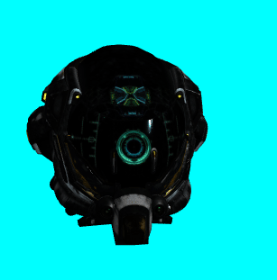

# vue-3d-loader

vueJS + threeJS整合的一个3d展示组件。  

支持.dae/.fbx/.gltf/.glb/.obj/.ply/.stl/.json，并支持同一个场景导入多个不同3D模型，支持mtl材质以及jpg/png等图片纹理

[](https://www.npmjs.com/package/vue-3d-loader) [](https://www.npmjs.com/package/vue-3d-loader) [](https://www.npmjs.com/package/vue-3d-loader)

[English](./readme.md)

文档：<https://king2088.github.io/vue-3d-loader-docs/zh/>

演示动画



vue3请安装**2.0.0**及以上版本，vue2请安装**1.x.x**版本

## 功能支持列表

- 加载单个3D模型
- 同时加载多个3D模型
- 同时加载多个不同类型3D模型
- 加载Draco压缩gltf模型(使用方法请查看API)
- 支持自定义文件类型（用于无文件后缀名url）
- 设置场景宽高
- 设置材质及纹理
- 交互控制
- 鼠标事件
- 灯光
- 相机位置及旋转
- 添加标注点

## 安装

```shell
npm i vue-3d-loader -S
```

或

```shell
yarn add vue-3d-loader
```

## 使用

全局使用，在入口文件中全局安装，代码如下：

```js
/* vue2 */
import vue3dLoader from "vue-3d-loader";
Vue.use(vue3dLoader)

/* vue3 */
import vue3dLoader from "vue-3d-loader";
createApp(App).use(vue3dLoader).mount('#app')
```

非全局使用，在Vue文件中使用如下代码:

```js
import { vue3dLoader } from "vue-3d-loader"; // 注意 vue3dLoader 写在 {...} 内
```

在组件中使用标签`<vue3dLoader></vue3dLoader>`

```vue
<vue3dLoader
  :height="200"
  :showFps="true"
  :filePath="['/fbx/1.fbx', '/obj/2.obj', '/gltf/3.gltf']"
  :mtlPath="[null, '/obj/2.mtl', null]"
  :backgroundColor="0xff00ff"
></vue3dLoader>
```

## API

### 属性

<table>
<tr>
  <th>属性名</th>
  <th style="min-width:100px">类型</th>
  <th>默认值</th>
  <th>值</th>
  <th>描述</th>
</tr>
<tr>
  <td>
  filePath
  </td>
  <td>string | array</td>
  <td>-</td>
  <td style="font-size: 12px">

  ```js
  const filePath = './models/tree.obj'
  /* or */
  const filePath = [
    './models/tree.obj',
    './models/building.obj'
  ]
  ```

  </td>
  <td>
  
  文件路径，支持多个文件一起加载，注意：如果每个文件对应一个材质，需要将材质**mtlPath**设置为数组。图片纹理也一样需要设置**textureImage**为数组
  </td>
</tr>
<tr>
  <td>
  fileType
  </td>
  <td>string | array</td>
  <td>-</td>
  <td>

  ```js
  const fileType = 'obj'
  /* or */
  const fileType = ['obj', 'gltf']
  ```

  </td>
  <td>
  
  文件类型，主要用于无法判断3d模型文件后缀名的url地址，与filePath一起使用，当filePath为数组时，此选项必须为数组
  </td>
</tr>
<tr>
  <td>
  mtlPath
  </td>
  <td>string | array</td>
  <td>-</td>
  <td style="font-size: 12px">

  ```js
  const mltPath = './models/tree.mlt'
  /* or */
  const mltPath = [
    './models/tree.mlt', 
    './models/building.mlt'
  ]
  ```

  </td>
  <td>

  .mtl材质路径，支持多个材质一起加载，设置此参数为数组，必须设置**filePath**为数组
  </td>
</tr>
<tr>
  <td>
  textureImage
  </td>
  <td>string | array</td>
  <td>-</td>
  <td style="font-size: 12px">

  ```js
  const textureImage = './texture/tree.jpg'
  /* or */
  const textureImage = [
    './texture/tree.jpg'
    ,null,
    './building.png'
  ]
  ```

  </td>
  <td>

  jpg/png纹理加载，与**filePath**一一对应，为数组时，必须设置**filePath**为数组
  </td>
</tr>
<tr>
  <td>
  width
  </td>
  <td>number</td>
  <td>parent element width</td>
  <td>100</td>
  <td>
  场景宽度
  </td>
</tr>
<tr>
  <td>
  height
  </td>
  <td>number</td>
  <td>parent element height</td>
  <td>100</td>
  <td>
  场景高度
  </td>
</tr>
<tr>
  <td>
  position
  </td>
  <td>object | array</td>
  <td>{x:0, y:0, z:0}</td>
  <td style="font-size: 12px">
  
  ```js
  const position = {x:0, y:0, z:0}
  // or
  const position = [
    {x:10, y:10, z:10},
    {x:50, y:50, z:50}
  ]
  ```

  </td>
  <td>
  模型位置坐标，filePath类型为array时可用array
  </td>
</tr>
<tr>
  <td>
  rotation
  </td>
  <td>object | array</td>
  <td>{x:0, y:0, z:0}</td>
  <td style="font-size: 12px">
  
  ```js
  const rotation = {x:0, y:0, z:0}
  // or
  const rotation = [
    {x: 10, y:20, z:30},
    {x: 0, y: 16, z: 20}
  ]
  ```

  </td>
  <td>
  模型旋转坐标，filePath类型为array时可用array
  </td>
</tr>
<tr>
  <td>
  cameraPosition
  </td>
  <td>object</td>
  <td>{x:0, y:0, z:0}</td>
  <td style="font-size: 12px">
  
  ```js
  const cameraPosition = {x:0, y:0, z:0}
  ```

  </td>
  <td>
  摄像机位置坐标
  </td>
</tr>
<tr>
  <td>
  cameraRotation
  </td>
  <td>object</td>
  <td>{x:0, y:0, z:0}</td>
  <td style="font-size: 12px">
  
  ```js
  const cameraRotation = {x:0, y:0, z:0}
  ```

  </td>
  <td>
  摄像机旋转坐标
  </td>
</tr>
<tr>
  <td>
  scale
  </td>
  <td>object | array</td>
  <td>{x:1, y:1, z:1}</td>
  <td style="font-size: 12px">
  
  ```js
  const scale = {x:1, y:2, z:1}
  // or
  const scale = [
    {x:1, y:2, z:1},
    {x:0.5, y:0.5, z:0.5}
  ]
  ```

  </td>
  <td>
  模型比例，filePath类型为array时可用array
  </td>
</tr>
<tr>
  <td>
  lights
  </td>
  <td>array</td>
  <td>[{
        type: "AmbientLight",
        color: 0xaaaaaa,
      },
      {
        type: "DirectionalLight",
        position: { x: 1, y: 1, z: 1 },
        color: 0xffffff,
        intensity: 0.8,
      }]</td>
  <td style="font-size: 12px">
  
  ```js
  const lights = [
    { 
      type: "AmbientLight", 
      color: "red", 
    }, 
    { 
      type: "DirectionalLight", 
      position: { x: 100, y: 10, z: 100 }, 
      color: "green", 
      intensity: 0.8, 
    }, 
    { 
      type: "PointLight", 
      color: "#000000", 
      position: { x: 200, y: -200, z: 100 }, 
      intensity: 1 
    }, 
    { 
      type: "HemisphereLight",
      skyColor: "#00FF00",
      groundColor: "#000000",
      position: { x: 200, y: -200, z: 100 }
    }
  ]
  ```

  </td>
  <td>
  灯光为数组，type为 环境光(AmbientLight) | 方向光(DirectionalLight) | 点光(PointLight) | 半球光(HemisphereLight)
  </td>
</tr>
<tr>
  <td>
  backgroundColor
  </td>
  <td>number | string</td>
  <td>0xffffff</td>
  <td style="font-size: 12px">
  
  ```js
  const bgColor = 0xff00ff
  /* or */
  const bgColor = 'red'
  /* or */
  const bgColor = '#000000'
  /* or */
  const bgColor = 'rgba(0, 0, 0, 0.5)'
  ```

  </td>
  <td>
  场景背景色
  </td>
</tr>
<tr>
  <td>
  backgroundAlpha
  </td>
  <td>number</td>
  <td>1</td>
  <td style="font-size: 12px">
  
  ```js
  const bgAlpha = 0.5
  ```

  </td>
  <td>
  场景背景透明度, 值范围0-1
  </td>
</tr>
<tr>
  <td>
  controlsOptions
  </td>
  <td>object</td>
  <td>-</td>
  <td>-</td>
  <td>

  控制参数 [OrbitControls Properties](https://threejs.org/docs/#examples/en/controls/OrbitControls)
  </td>
</tr>
<tr>
  <td>
  crossOrigin
  </td>
  <td>string</td>
  <td>anonymous</td>
  <td>anonymous | use-credentials</td>
  <td>
  跨域配置
  </td>
</tr>
<tr>
  <td>
  requestHeader
  </td>
  <td>object</td>
  <td>anonymous</td>
  <td style="font-size: 12px">
  
  ```js
  const headers = { 
    'Authorization': 'Bearer token'
  }
  ```

  </td>
  <td>
  设置请求头
  </td>
</tr>
<tr>
  <td>
  outputEncoding
  </td>
  <td>string</td>
  <td>linear</td>
  <td>liner 或 sRGB</td>
  <td>

  linear 是 LinearEncoding 线性编码, sRGB 即 sRGBEncoding rgb模式编码（sRGBEncoding能更好的还原材质颜色）。
  渲染器的输出编码 [WebGLRenderer OutputEncoding](https://threejs.org/docs/index.html#api/en/renderers/WebGLRenderer.outputEncoding)
  </td>
</tr>
<tr>
  <td>
  webGLRendererOptions
  </td>
  <td>object</td>
  <td>{ antialias: true, alpha: true }</td>
  <td>-</td>
  <td>

  WebGLRenderer可选参数 [WebGLRenderer Parameters](https://threejs.org/docs/index.html#api/zh/renderers/WebGLRenderer)
  </td>
</tr>
<tr>
  <td>
  showFps
  </td>
  <td>boolean</td>
  <td>false</td>
  <td>-</td>
  <td>

  显示FPS等信息
  </td>
</tr>
<tr>
  <td>
  clearScene
  </td>
  <td>boolean</td>
  <td>false</td>
  <td>-</td>
  <td>清空场景中的内容</td>
</tr>
<tr>
  <td>
  parallelLoad
  </td>
  <td>boolean</td>
  <td>false</td>
  <td>-</td>
  <td>
  
  开启/关闭并行加载模型（仅在多模型下有效）**注意：使用此属性后，load进度process事件将不可预测**
  </td>
</tr>
<tr>
  <td>
  labels
  </td>
  <td>array</td>
  <td>-</td>
  <td style="font-size: 12px">
  
  ```js
  const labels = [
    {
      image: "", 
      text: "", 
      textStyle: { 
        fontFamily: "Arial", 
        fontSize: 18, 
        fontWeight: "normal", 
        lineHeight: 1, 
        color: "#ffffff", 
        borderWidth: 8, 
        borderRadius: 4, 
        borderColor: "rgba(0,0,0,1)",
        backgroundColor: "rgba(0, 0, 0, 1)" 
      }, 
      position: {x:0, y:0, z:0}, 
      scale:{x:1, y:1, z:0}, 
      sid: null
    }
  ]
  ```

  </td>
  <td>
  
  添加图片/文字标签，设置image则显示图片标签。设置text显示文字标签，文字样式通过textStyle进行设置，样例可以查看[examples/add-label.vue](./src/examples/add-label.vue)文件
  </td>
</tr>
<tr>
  <td>
  autoPlay
  </td>
  <td>boolean</td>
  <td>true</td>
  <td>-</td>
  <td>
  播放/停止动画
  </td>
</tr>
<tr>
  <td>
  enableDraco
  </td>
  <td>boolean</td>
  <td>false</td>
  <td>-</td>
  <td>

  加载Gltf draco模型需开启draco解密，开启后需要[下载draco解密库](https://github.com/king2088/vue-3d-loader/blob/master/public/assets/draco.7z)放到默认目录assets中，默认目录为assets/draco/gltf/，如需修改默认目录，请查看参数<i>dracoDir</i>。[关于draco请查阅](https://threejs.org/docs/index.html?q=draco#examples/en/loaders/DRACOLoader)
  </td>
</tr>
<tr>
  <td>
  dracoDir
  </td>
  <td>string</td>
  <td>assets/draco/gltf/</td>
  <td>-</td>
  <td>
  draco解密库默认目录，可自行修改
  </td>
</tr>
<tr>
  <td>
  intersectRecursive
  </td>
  <td>boolean</td>
  <td>false</td>
  <td>-</td>
  <td>

  若为true，则同时也会检测所有物体的后代。否则将只会检测对象本身的相交部分。
  </td>
</tr>
<tr>
  <td>
  enableDamping
  </td>
  <td>boolean</td>
  <td>false</td>
  <td>-</td>
  <td>

  [enableDamping](https://threejs.org/docs/index.html#examples/zh/controls/OrbitControls.enableDamping)设置为true以启用阻尼（惯性），这将给控制器带来重量感。
  </td>
</tr>
<tr>
  <td>
  dampingFactor
  </td>
  <td>number</td>
  <td>-</td>
  <td>-</td>
  <td>

  enableDamping必须为true，此选项才有效。[dampingFactor](https://threejs.org/docs/index.html#examples/zh/controls/OrbitControls.dampingFactor)用于设置阻尼惯性大小。
  </td>
</tr>
<tr>
  <td>
  verticalCtrl
  </td>
  <td>boolean | object</td>
  <td>false</td>
  <td>-</td>
  <td>

  为true，仅能垂直旋转相机。
  </td>
</tr>
<tr>
  <td>
  horizontalCtrl
  </td>
  <td>boolean | object</td>
  <td>false</td>
  <td>-</td>
  <td>

  为true，仅能水平旋转相机。
  </td>
</tr>
<tr>
  <td>
  plyMaterial
  </td>
  <td>string</td>
  <td>MeshStandardMaterial</td>
  <td>-</td>
  <td>

  值仅有两个 `MeshStandardMaterial` 和 `MeshBasicMaterial`. 用于ply模型. [MeshStandardMaterial相关文档](https://threejs.org/docs/#api/en/materials/MeshStandardMaterial).[MeshBasicMaterial相关文档](https://threejs.org/docs/?q=MeshBasicMaterial#api/en/materials/MeshBasicMaterial)
  </td>
</tr>
<tr>
  <td>
  enableAxesHelper
  </td>
  <td>boolean</td>
  <td>false</td>
  <td>-</td>
  <td>

  开启并在场景中显示x,y,z轴
  </td>
</tr>
<tr>
  <td>
  axesHelperSize
  </td>
  <td>number</td>
  <td>100</td>
  <td>-</td>
  <td>

  x,y,z轴的尺寸
  </td>
</tr>
<tr>
  <td>
  enableGridHelper
  </td>
  <td>boolean</td>
  <td>false</td>
  <td>-</td>
  <td>

  开启并在场景中显示网格
  </td>
</tr>
<tr>
  <td>
  minDistance
  </td>
  <td>float</td>
  <td>0</td>
  <td>-</td>
  <td>

  你能够将相机向内移动多少，其默认值为0
  </td>
</tr>
<tr>
  <td>
  maxDistance
  </td>
  <td>float</td>
  <td>Infinity</td>
  <td>-</td>
  <td>

  你能够将相机向外移动多少，其默认值为Infinity
  </td>
</tr>
<tr>
  <td>pointLightFollowCamera</td>
  <td>boolean</td>
  <td>false</td>
  <td>-</td>
  <td>

  开启点光源跟随相机
  </td>
</tr>
</table>

### 事件

| event                        | description                            |
| ---------------------------- | -------------------------------------- |
| mousedown(event, intersects) | 鼠标按下, intersect:当前相交最近的物体 |
| mousemove(event, intersects) | 鼠标移动, intersect:当前相交最近的物体 |
| mouseup(event, intersects)   | 鼠标放开, intersect:当前相交最近的物体 |
| click(event, intersects)     | 点击, intersect:当前相交最近的物体     |
| load                         | 加载模型事件                           |
| process(event, fileIndex)    | 加载进度, fileIndex:当前加载模型的索引 |
| error(event)                 | 错误事件                               |

### 使用样例

#### 1. 加载一个3D模型

目前支持dae/fbx/gltf(glb)/obj/ply/stl中任意一种

```vue
<!-- 加载fbx模型 -->
<vue3dLoader filePath="models/collada/stormtrooper/stormtrooper.dae"></vue3dLoader>
<!-- 加载obj模型 -->
<vue3dLoader filePath="/obj/1.obj"></vue3dLoader>
```

#### 2. 同一个场景中加载多个模型

```vue
<!-- 
    可同时加载多个不同种类的模型,
    支持单独设置每一个模型的位置/缩放/旋转
-->
<template>
  <div class="check-box">
    <input type="checkbox" @change="change($event, 'position')" checked /> Set
    position
    <input type="checkbox" @change="change($event, 'rotation')" checked /> Set
    rotation
    <input type="checkbox" @change="change($event, 'scale')" checked /> Set
    scale
  </div>
  <vue3dLoader
    :filePath="filePath"
    :position="position"
    :rotation="rotation"
    :scale="scale"
    :cameraPosition="{ x: -0, y: 0, z: -500 }"
  />
</template>
<script setup lang="ts">
import { ref } from "vue";
const filePath = ref();
filePath.value = [
  "/models/fbx/Samba Dancing.fbx",
  "/models/collada/pump/pump.dae",
];
const position = ref();
position.value = [
  { x: 0, y: 0, z: 0 },
  { x: 100, y: 100, z: 100 },
];
const rotation = ref();
rotation.value = [
  { x: 0, y: 0, z: 0 },
  { x: 10, y: 1, z: 1 },
];
const scale = ref();
scale.value = [
  { x: 0.4, y: 0.4, z: 0.4 },
  { x: 0.8, y: 0.8, z: 0.8 },
];

function change(event: any, type: string) {
  const value = event.target.checked;
  switch (type) {
    case "position":
      value
        ? (position.value = [
            { x: 0, y: 0, z: 0 },
            { x: 100, y: 100, z: 100 },
          ])
        : (position.value = []);
      break;
    case "rotation":
      value
        ? (rotation.value = [
            { x: 0, y: 0, z: 0 },
            { x: 10, y: 1, z: 1 },
          ])
        : (rotation.value = []);
      break;
    case "scale":
      value
        ? (scale.value = [
            { x: 0.4, y: 0.4, z: 0.4 },
            { x: 0.8, y: 0.8, z: 0.8 },
          ])
        : (scale.value = []);
      break;
  }
}
</script>
```

#### 3. 材质及纹理加载

```vue
<!-- obj加载mtl材质 -->
<vue3dLoader filePath="/obj/1.obj" mtlPath="/obj/1.mtl" ></vue3dLoader>
<!-- fbx图片纹理加载 -->
<vue3dLoader filePath="/fbx/1.fbx" textureImage="/fbx/1.png" ></vue3dLoader>
```

#### 4. 背景颜色及透明度

```vue
<vue3dLoader filePath="/fbx/1.fbx" :backgroundAlpha="0.5" backgroundColor="red"></vue3dLoader>
```

#### 5. 交互控制controls

```vue
<template>
  <div class="controls">
    <div class="buttons">
      <!-- 禁止右键拖动 -->
      <button @click="enablePan = !enablePan">
        {{ enablePan ? "disable" : "enable" }} translation
      </button>
      <!-- 禁止缩放 -->
      <button @click="enableZoom = !enableZoom">
        {{ enableZoom ? "disable" : "enable" }} zoom
      </button>
      <!-- 禁止旋转 -->
      <button @click="enableRotate = !enableRotate">
        {{ enableRotate ? "disable" : "enable" }} rotation
      </button>
    </div>
    <vue3dLoader
      :filePath="'/models/collada/elf/elf.dae'"
      :controlsOptions="{
        enablePan,
        enableZoom,
        enableRotate,
      }"
      :cameraPosition="{ x: 0, y: -10, z: 13 }"
    />
  </div>
</template>
<script setup lang="ts">
  import { ref } from "vue";
  const enablePan = ref(true);
  const enableZoom = ref(true);
  const enableRotate = ref(true);
</script>
```

#### 6. 旋转模型

```vue
<template>
  <vue3dLoader
    :rotation="rotation"
    @load="onLoad()"
    filePath="/models/collada/elf/elf.dae"
  />
</template>
<script setup lang="ts">
  import { ref } from "vue";
  const rotation = ref();
  rotation.value = {
    x: -Math.PI / 2,
    y: 0,
    z: 0,
  };
  function onLoad() {
    rotate();
  }
  function rotate() {
    requestAnimationFrame(rotate);
    rotation.value.z -= 0.01;
  }
</script>
```

#### 7. 事件

```vue
<template>
  <vue3dLoader filePath="/models/ply/Lucy100k.ply" @mousemove="onMouseMove" />
</template>
<script setup lang="ts">
  import { ref } from "vue";
  const object = ref(null);
  function onMouseMove(event: MouseEvent, intersected: any) {
    if (object.value) {
      (object.value as any).material.color.setStyle("#fff");
    }
    if (intersected) {
      object.value = intersected.object;
      (object.value as any).material.color.setStyle("#13ce66");
    }
  }
</script>
```

#### 8. 加载draco模型

此功能需要先下载draco库存储与本地项目的静态文件夹内，才可以正常加载，下载地址：<https://github.com/king2088/vue-3d-loader/blob/master/public/assets/draco.7z>

```vue
<template>
  <vue3dLoader
    filePath="/models/gltf/LittlestTokyo.glb"
    :cameraPosition="{ x: 10, y: 700, z: 1000 }"
    :enableDraco="true"
    dracoDir="/draco/"
    outputEncoding="sRGB"
  />
</template>
```

#### 9. 更多演示

[点我查看更多演示代码](https://github.com/king2088/vue-3d-loader/tree/master/src/examples)

### Docker部署examples
```shell
  docker build -t vue/vue-3d-loader .
  # 运行docker
  docker run -p 8010:80 vue/vue-3d-loader
```

### 即将到来

- [x] 支持Vue3

### bug提交

[issues](https://github.com/king2088/vue-3d-loader/issues)

### 捐助


### 感谢

本插件参考[vue-3d-model](https://github.com/hujiulong/vue-3d-model)实现
